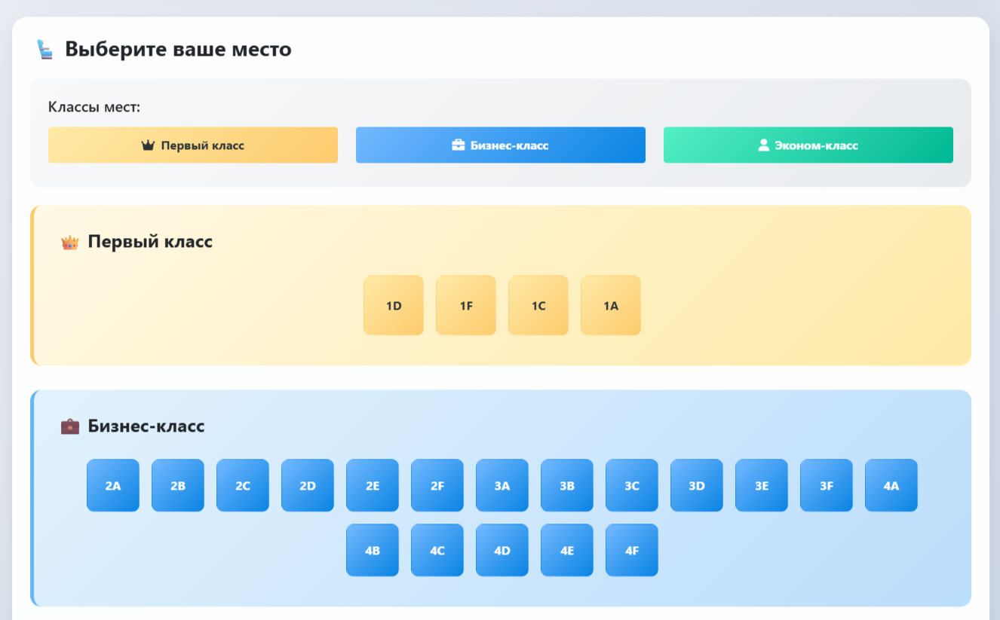
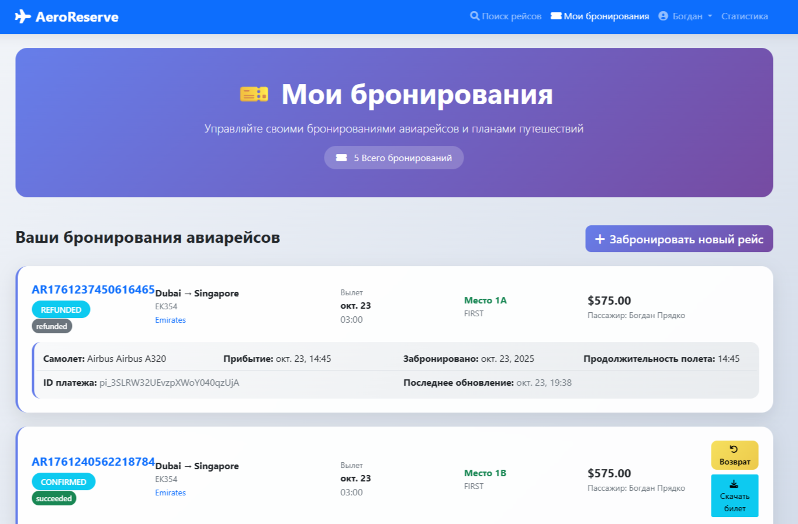
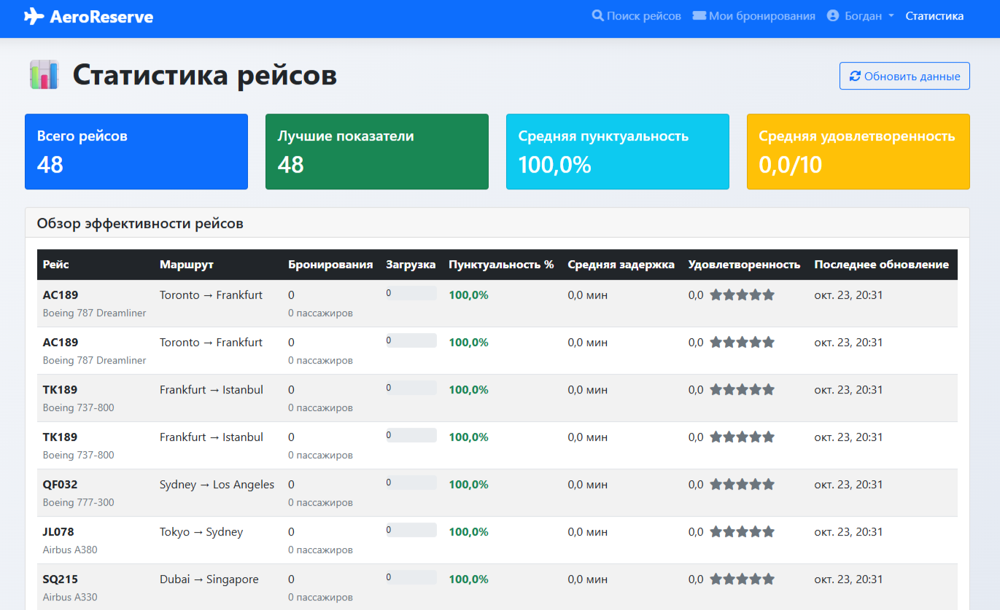
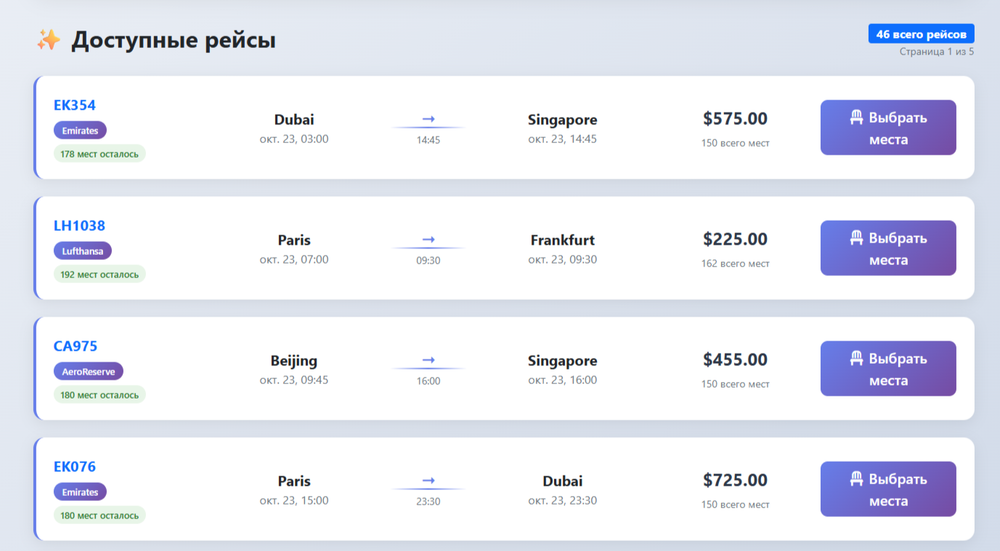
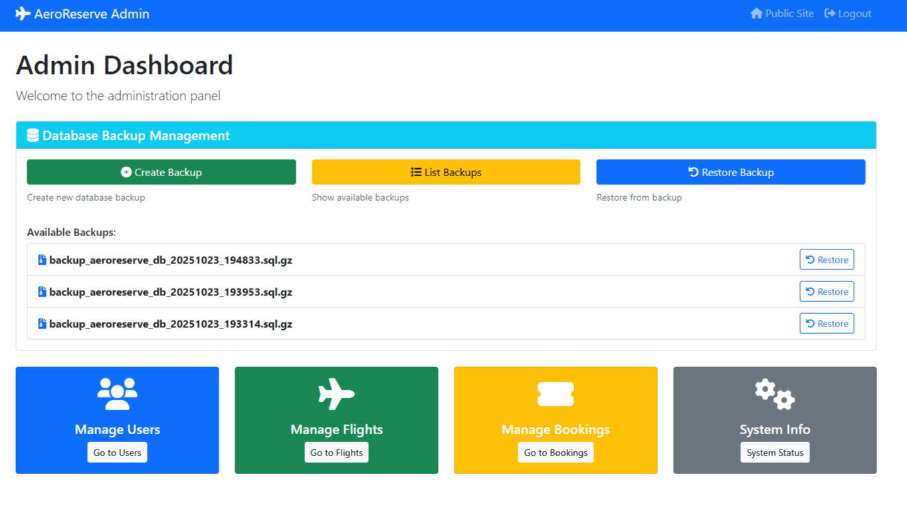
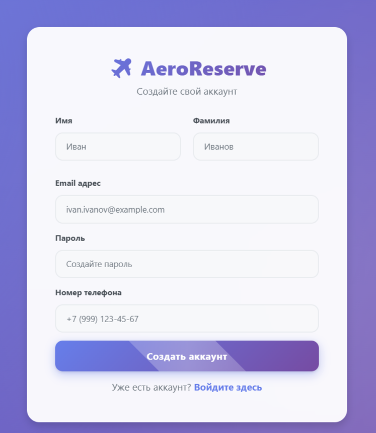
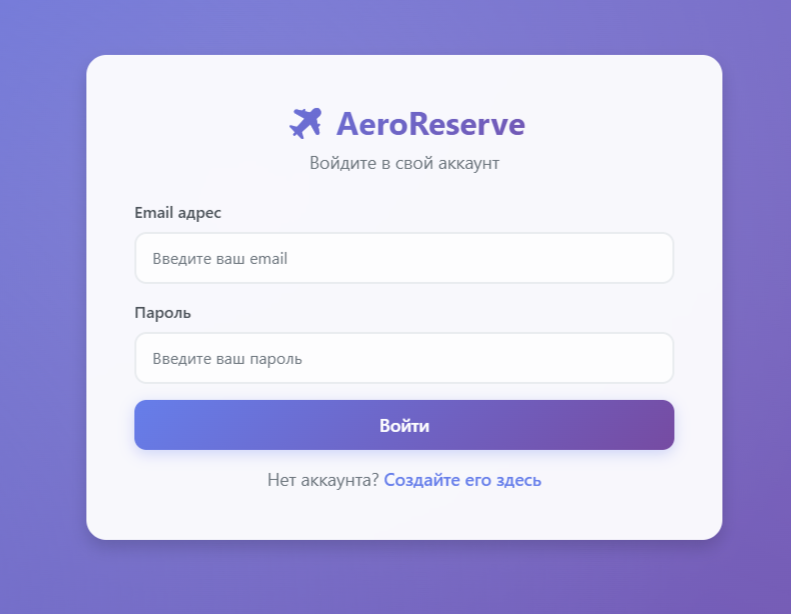
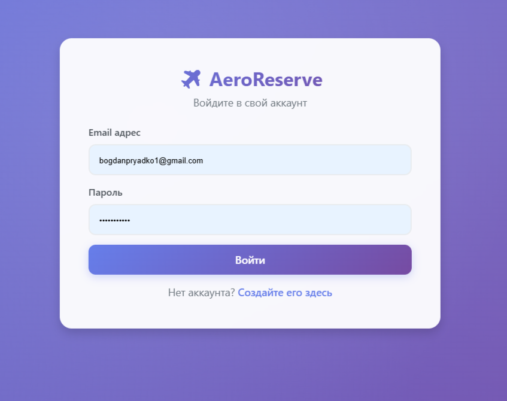

# ✈️ AeroReserve - Система управления бронированием авиабилетов

## 📖 О проекте

**AeroReserve** - это полнофункциональная веб-платформа для бронирования авиабилетов,
### 🎯 Ключевые преимущества

- **🚀 Высокая производительность**
- **🔐 Безопасность**
- **📱 Адаптивность** 
- **🛠️ Масштабируемость**
- **💾 Надежность** 

## 🚀 Возможности

### ✨ Основной функционал
- **🔍 Умный поиск рейсов** - Фильтрация по направлениям, датам и авиакомпаниям
- **💺 Выбор мест** - Интерактивная карта мест с отображением доступности
- **💳 Безопасные платежи** - Полная интеграция с Stripe (карты, Google/Apple Pay)
- **📧 Email уведомления** - Автоматические уведомления о статусе бронирования
- **🎫 Электронные билеты** - Генерация PDF с QR-кодами для посадки

### 🛠️ Административная панель
- **✈️ Управление рейсами** - Полный CRUD для расписания и тарифов
- **👥 Управление пользователями** - Модерация и ролевое управление
- **📈 Статистика**
- **💾 Резервное копирование** - Автоматические бэкапы в MinIO

## 🛠️ Технологический стек

### Backend
- **Java 17** - Основной язык программирования
- **Spring Boot 3.1** - Фреймворк для enterprise приложений
- **Spring Security** - Аутентификация и авторизация
- **Spring Data JPA** - Работа с базой данных
- **Hibernate** - ORM mapping

### Frontend
- **Thymeleaf** - Server-side шаблонизатор
- **Bootstrap 5** - CSS фреймворк
- **JavaScript** - Клиентская логика
- **Chart.js** - Визуализация статистики

### База данных
- **PostgreSQL 15** - Основная реляционная БД
- **Flyway** - Миграции и управление схемой
- **HikariCP** - Connection pooling

### Платежи и интеграции
- **Stripe API** - Обработка платежей
- **SMTP/Gmail** - Email рассылки
- **MinIO** - Object storage для бэкапов

### Инфраструктура
- **Docker** - Контейнеризация
- **Docker Compose** - Оркестрация сервисов
- **Maven** - Сборка проекта

# 🛠️ Архитектура проекта

### System Design

### ER в нотации Чена

### ER в нотации Crow’s Foot

## 📸 Скрины проекта

